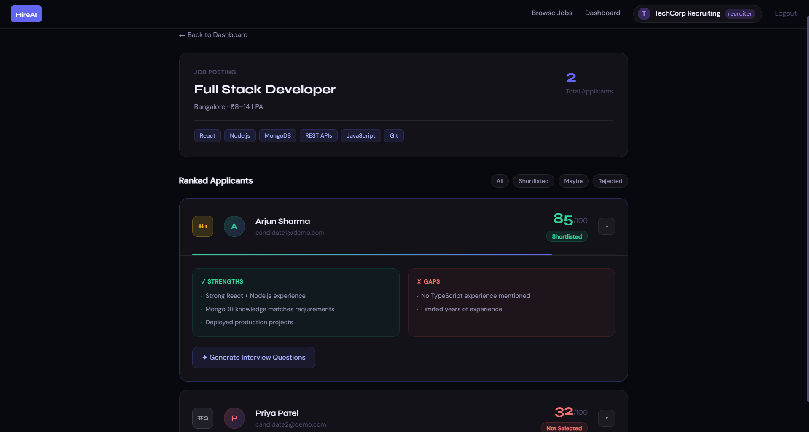

# HireAI — AI-Powered Hiring Assistant
[](https://smart-hiring-assistant-hireai.vercel.app)
[](https://www.loom.com/share/901c3bb1208f4030ad485b42250a0b3e)
[](https://github.com/SrujanRNaik/smart-hiring-assistant/tree/main/frontend)
A full-stack AI hiring assistant that automatically scores candidate
resumes against job requirements using Google Gemini. Recruiters see
candidates ranked by AI fit score — no manual resume screening required.
---
## 🎬 Demo
[](https://www.loom.com/share/901c3bb1208f4030ad485b42250a0b3e)
**Live App:** https://smart-hiring-assistant-hireai.vercel.app
| Role | Email | Password |
|------|-------|----------|
| Recruiter | recruiter@demo.com | demo1234 |
| Candidate (strong) | candidate1@demo.com | demo1234 |
| Candidate (fresher) | candidate2@demo.com | demo1234 |
---
## ✦ Key Features
- **AI Resume Scoring** — Gemini reads each resume against job requirements
and returns a fit score (0–100), verdict, strengths and skill gaps
- **Max-Heap Candidate Ranking** — candidates sorted by score using a custom
JavaScript max-heap implementation (O(k log n) vs plain sort)
- **Targeted Interview Questions** — AI generates 5 questions per candidate
targeting their specific weak areas, not generic questions
- **PDF Resume Parsing** — multer + pdf-parse extracts text from uploaded PDFs
before sending to Gemini — no binary files in the AI prompt
- **Role-Based Access** — JWT auth with recruiter and candidate roles,
protected routes, ownership checks throughout
---
## 🛠 Tech Stack
| Layer | Technology |
|-------|-----------|
| Frontend | React 18 + Vite + inline CSS |
| Backend | Node.js + Express |
| Database | MongoDB Atlas + Mongoose |
| AI | Google Gemini API (gemini-1.5-flash) |
| Auth | JWT + bcryptjs |
| File Upload | multer (memory storage) + pdf-parse |
| Deploy (FE) | Vercel |
| Deploy (BE) | Railway |
---
## 🏗 Architecture
```
Browser (Vercel) Backend (Railway) Database + AI
───────────────── ───────────────── ─────────────
React + Vite → Express REST API → MongoDB Atlas
JWT Auth Gemini API
multer + pdf-parse
Max-Heap ranking
```
**AI Scoring Flow:**
```
PDF Upload → pdf-parse extracts text → Gemini prompt built
(JD + requirements + resume text) → Gemini returns JSON
{ fitScore, verdict, strengths, weaknesses } → saved to MongoDB
```
---
## 📡 API Routes
| Method | Route | Auth | Description |
|--------|-------|------|-------------|
| POST | /api/auth/register | — | Register user |
| POST | /api/auth/login | — | Login, get JWT |
| GET | /api/auth/me | ✓ | Current user |
| GET | /api/jobs | — | All open jobs |
| POST | /api/jobs | Recruiter | Create job |
| DELETE | /api/jobs/:id | Recruiter | Delete job |
| POST | /api/applications | Candidate | Apply + AI score |
| GET | /api/applications/ranked | Recruiter | Heap-ranked list |
| POST | /api/resume/parse | ✓ | Parse PDF text |
| GET | /api/interview/:id | Recruiter | Generate questions |
---
## 🚀 Run Locally
**Prerequisites:** Node.js 18+, MongoDB Atlas account, Gemini API key
### Backend
```bash
git clone https://github.com/YOUR_USERNAME/smart-hiring-backend.git
cd smart-hiring-backend
npm install
```
Create `.env`:
```env
PORT=5000
MONGO_URI=your_mongodb_atlas_uri
JWT_SECRET=your_jwt_secret
GEMINI_API_KEY=your_gemini_key
FRONTEND_URL=http://localhost:5173
```
```bash
npm run dev # starts on http://localhost:5000
npm run seed # seeds demo data into DB
```
### Frontend
```bash
git clone https://github.com/YOUR_USERNAME/smart-hiring-frontend.git
cd smart-hiring-frontend
npm install
```
Create `.env`:
```env
VITE_API_URL=http://localhost:5000/api
```
```bash
npm run dev # starts on http://localhost:5173
```
---
## 💡 Technical Highlights
**Max-Heap Ranking** — instead of a plain `.sort()`, candidates are
ranked using a custom max-heap. For top-K selection from N candidates,
this avoids sorting all elements when only the top few are needed.
**AI Prompt Engineering** — the Gemini prompt passes job title,
description, requirements array, and full resume text separately.
Structured JSON output is enforced via prompt instructions and
validated before saving — with a safe fallback if parsing fails.
**Security** — passwords hashed with bcrypt (salt rounds: 10),
JWT tokens expire in 7 days, ownership checks on all write operations,
role-based guards on both frontend routes and backend controllers.
---
## 📄 License
MIT — built by Srujan R Naik